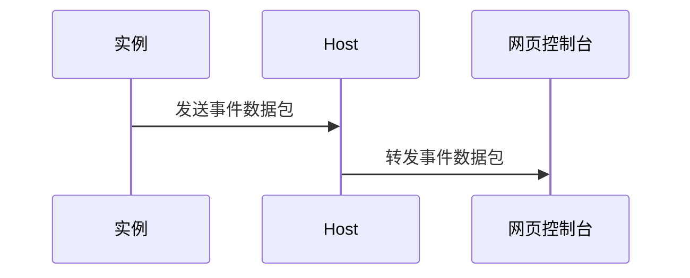

# 服务器广播

- [服务器开启](../packet/broadcast/serverStart)
- [服务器关闭](../packet/broadcast/serverStop)
- [服务器输出](../packet/broadcast/serverOutput)
- [服务器输入](../packet/broadcast/serverInput)

:::note

- **转发事件数据包**
  - 这一步还包含一步数据验证，不合法的数据将不会被转发
  - 只会转发给订阅目标为该实例的控制台

:::
