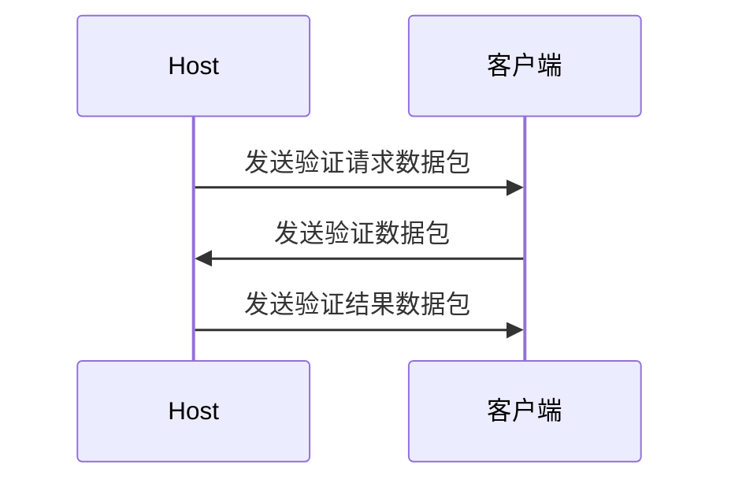

# 验证

:::note

- **发送[验证请求数据包](../packet/action/verifyRequest)**
  - 此时Host会在数据包中附加一段随机文本作为盐值
- **发送[验证数据包](../packet/action/verify)**
  - 其中的`token`值为'上文的盐值'+'密码'的md5的16进制小写字符串
  - 此步骤有时间限制（5s），超出时间限制后将被强制断开

:::
