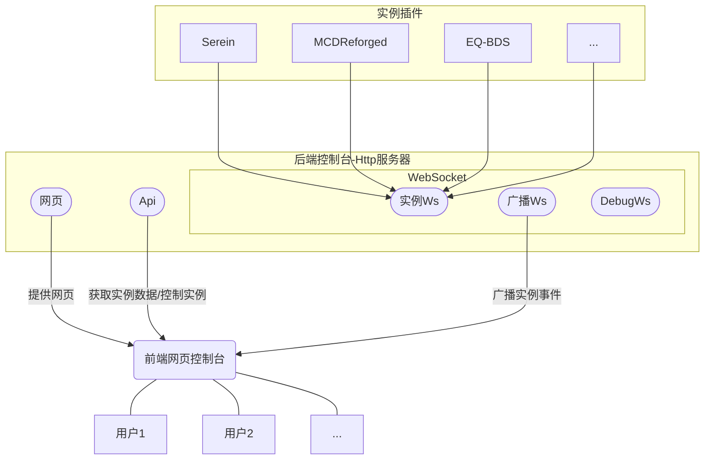

# 组成

可分为如下三个部分

import DocCardList from '@theme/DocCardList';

<DocCardList />

## 结构

```mermaid
flowchart TB
    subgraph 后端控制台-Http服务器
    subgraph WebSocket
    ws1(["实例Ws"])
    ws2(["广播Ws"])
    ws3(["DebugWs"])
    end
    web(["网页"])
    api(["Api"])
    end
    
    subgraph 实例插件
    i1["Serein"]
    i2["MCDReforged"]
    i3["EQ-BDS"]
    i4["..."]
    end
    
    i1 ---> ws1
    i2 ---> ws1
    i3 ---> ws1
    i4 ---> ws1

    u1["用户1"]
    u2["用户2"]
    u3["..."]
    website("前端网页控制台")

    website --- u1
    website --- u2
    website --- u3

    web --->|"提供网页"| website
    api --->|"获取实例数据/控制实例"| website
    ws2 --->|"广播实例事件"| website
```
