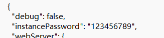
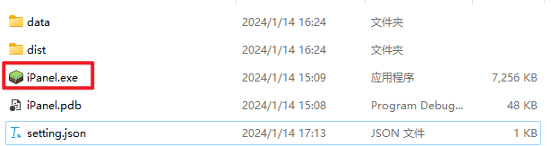
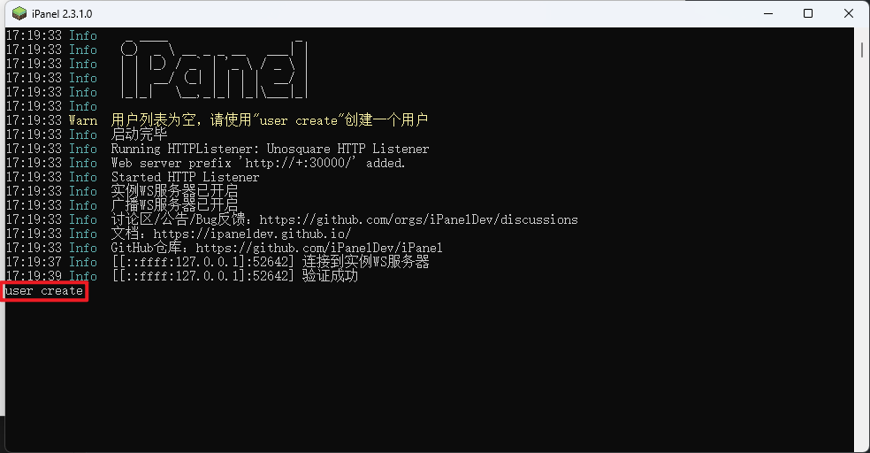
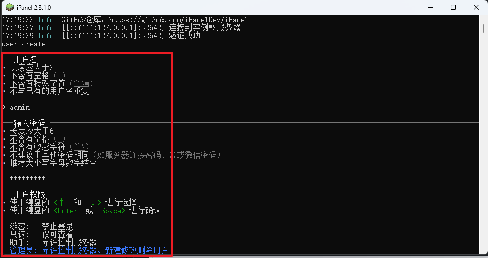
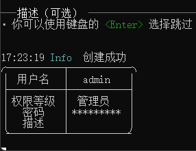
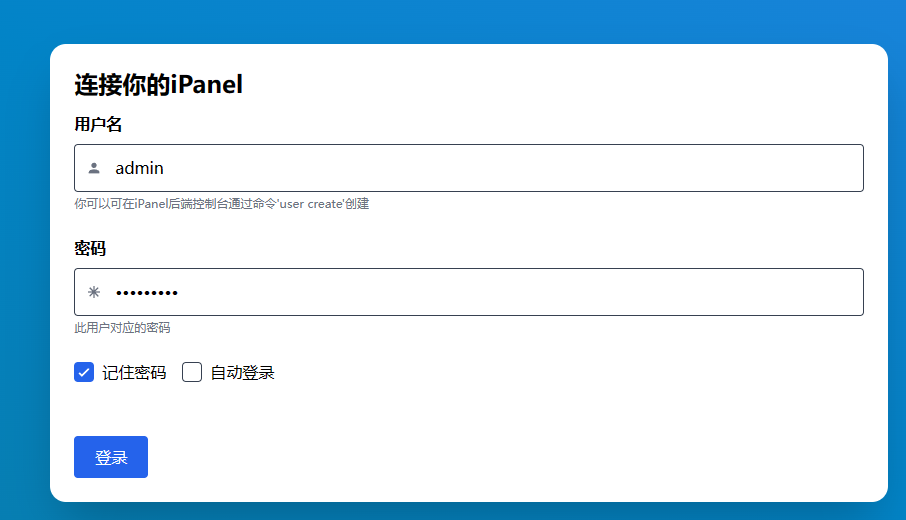
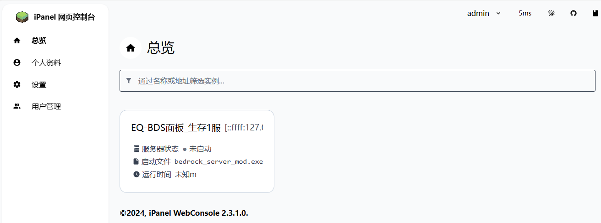

# EQ-BDS

## 0.更新面板到最新版本

## 1.下载iPanel_Host

去EQ面板网盘下载[https://wwzv.lanzoue.com/b03j2esyb](https://wwzv.lanzoue.com/b03j2esyb)

密码:h3ik

下载`适用于Windows的iPanel_2.3.1.7z`

## 2.修改iPanel配置

解压后打开``iPanel_2.3.1_win-x64\setting.json``，第三行`instancePassword`后面的双引号中间写入你自己的密码

注意：这个密码**不需要**记忆，随便打一串随机数字字母即可

本教程以123456789为例(自己配置时千万不要写这种简单的密码)

然后启动`iPanel.exe`

## 3.面板上开启自动启动iPanel插件

面板上可以开启自动启动iPanel插件的功能

然后我们是第一次使用，需要手动去打开面板目录下的`iPanel插件.exe`，后面这个插件会随面板启动

## 4.配置iPanel插件

修改好密码，也就是粘贴之前我们在`setting.json`里面乱打的那一串`instancePassword`

## 5.配置iPanel

先启动iPanel

输入`user create`，然后按下回车

按照提示创建一个账户

用户权限这里需要你用键盘的上下箭头选择，按回车键或空格确认选择

描述直接按回车键跳过，可以看到我们成功创建了个账户

## 6.配置完成

打开服务器上的浏览器访问[http://127.0.0.1:30000/](http://127.0.0.1:30000/)即可体验

输入我们上一步创建的账号密码，然后您就能在网页上控制EQ-BDS面板了

