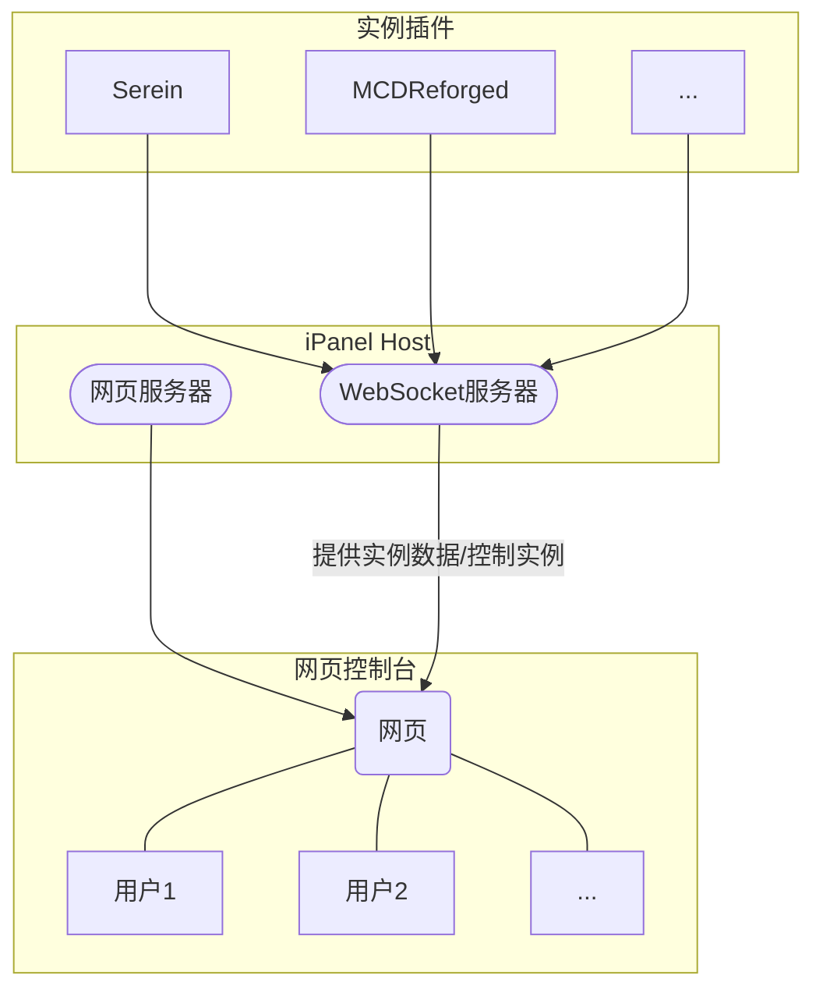

# 结构

## 实现原理

在服务器上使用`iPanel`开启ws服务器，实例和控制台通过连接此ws服务器进行通信

## 名称解释

### iPanel Host

iPanel系列的后端部分，用于建立各个实例和用户的间接连接

#### WebSocket服务器

提供实例、网页控制台和Host直接的便捷通信

#### 网页服务器

用于提供网页（可选择禁用）

### 实例插件

作为面板/服务器管理程序的插件，向iPanel Host同步信息

### 网页控制台

基于Vue3的静态网页，通过WebSocket从iPanel Host实时获取实例数据
