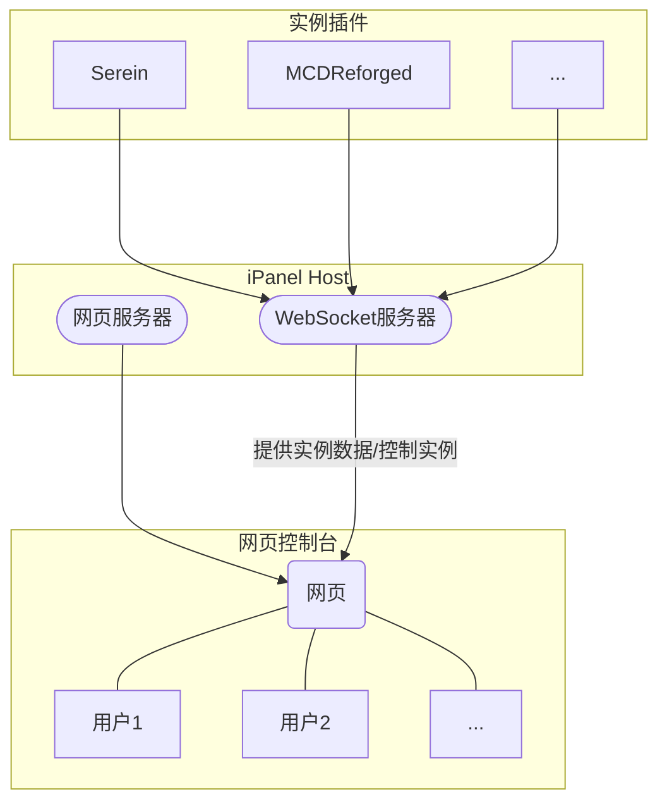

# ⛳ 入门

iPanel

如果你是一个萌新，或是刚认识iPanel的一个新用户，那你务必要完整阅读此页，这会对你有非常大的帮助:D

## ❔ 什么是iPanel

iPanel是一个可以为用户提供简约、快捷的网页控制台的软件。其组成可分为三个部分：

### iPanel Host

>Repo: <https://github.com/iPanelDev/iPanel-Host>

iPanel系列的后端部分，使用Net C#开发，用于建立各个实例和用户的连接

### 网页控制台

>Repo: <https://github.com/iPanelDev/WebConsole>

基于Vue3的静态网页，通过WebSocket从[iPanel Host](#ipanel-host)实时获取实例数据

### 实例插件

>Repo:  
> MCDReforged: <https://github.com/iPanelDev/iPanel-MCDReforged>

作为服务器面板/服务器管理程序的插件，向iPanel Host同步当前实例的信息

直观展示各部分之间的关系

## 💎 iPanel有何优点

### 易用

- 不需要太多的网络安全知识
  - 只需按着教程一步一步走即可
- 开箱即食
  - 解压将各文件放到相应目录下就能运行
- 没有繁琐的配置项

### 美观

- 精美的页面
- 支持一键切换暗黑模式
- 使用网页渲染彩色控制台，还原CMD或Power Shell等的原汁原味终端体验

### 低占用
  
- 一般情况下内存占用<20MB

### 安全

- 自动拒绝过期和无效的会话
- 自动判断数据包，防止发送异常包导致崩溃
