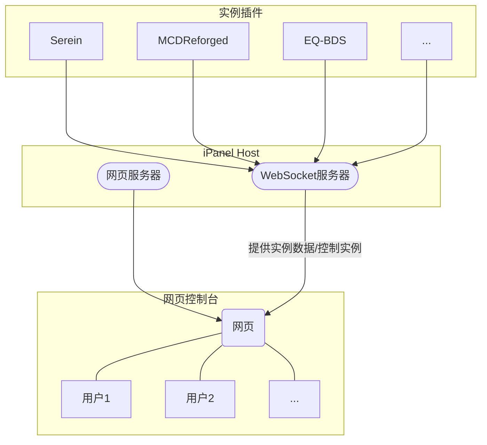

# ⛳ 入门

iPanel

如果你是一个萌新，或是刚认识iPanel的一个新用户，那你务必要完整阅读此页，这会对你有非常大的帮助:D

## ❔ 什么是iPanel

iPanel是一个可以为用户提供简约、快捷的网页控制台的软件。其组成可分为如下三个部分：

一张图直观展示各部分之间的关系

### iPanel Host

>你可以在[此处](guide/host/intro)阅读此节的更多信息

iPanel系列的后端部分，使用Net C#开发，用于建立各个实例和用户的连接

其中WebSocket服务器接收到请求后把相关请求发送给[实例插件](#实例插件)

### 实例插件

>你可以在[此处](guide/instance/intro)阅读此节的更多信息

作为服务器面板/服务器管理程序[二者下称实例，后同]的插件，向iPanel Host同步当前实例的信息，iPanel通过实例插件对接基本的服务器控制

:::note

- **实例** - 运行并管理服务器的程序
  - 面板 - [Serein](https://serein.cc)、[EQ-BDS](https://www.minebbs.com/threads/eq-bds-3-9.12782/)等**带用户操作界面**的服务器控制程序
  - 服务器管理程序 - [MCDReforged](https://github.com/Fallen-Breath/MCDReforged)等**只有命令行**的程序
- **实例插件** - 运行在实例上的iPanel插件
- **服务器程序** - `bedrock_server.exe`等运行MineCraft服务器的程序
:::

:::tip
你会发现这些实例都有一些共同特点

- 控制服务器程序的启停
- 获取输出的内容
- 获取系统的CPU/内存占用率等信息
:::

### 网页控制台

>你可以在[此处](guide/webConsole/intro)阅读此节的更多信息

基于Vue3的静态网页，通过WebSocket从[iPanel Host](#ipanel-host)实时获取实例数据

登录后浏览器会与iPanel Host实现的WebSocket服务器建立连接，完成身份鉴权后不断获取各类信息，同时把用户在网站上的操作发送到iPanel Host，再通过iPanel Host发送给实例

## 💎 iPanel有何优点

### 易用

- 不需要太多的网络安全知识
  - 只需按着教程一步一步走即可
- 开箱即食
  - 解压将各文件放到相应目录下就能运行
- 没有繁琐的配置项

### 美观

- 精美的页面
- 支持一键切换暗黑模式
- 使用网页渲染彩色控制台，还原CMD或Power Shell等的原汁原味终端体验

### 低占用
  
- 一般情况下内存占用<20MB

### 安全

- 自动拒绝过期和无效的会话
- 自动判断数据包，防止发送异常包导致崩溃
