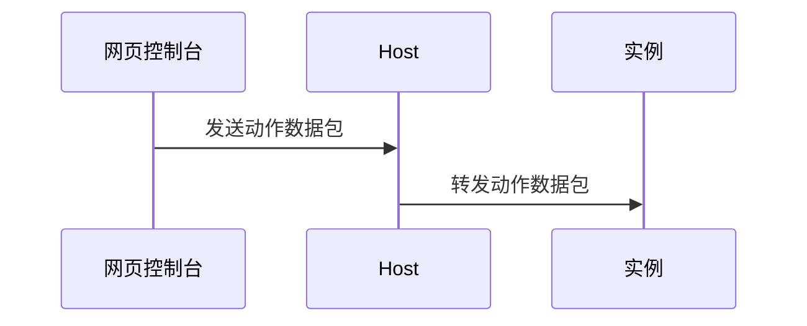

# 服务器动作

- [服务器输入](../packet/action/serverInput)
- [启动服务器](../packet/action/serverStart)
- [关闭服务器](../packet/action/serverStop)
- [强制结束服务器](../packet/action/serverKill)

:::note

- **转发动作数据包**
  - 这一步还包含一步数据验证，不合法的数据将不会被转发
  - 只会转发给该实例的订阅控制台

:::
